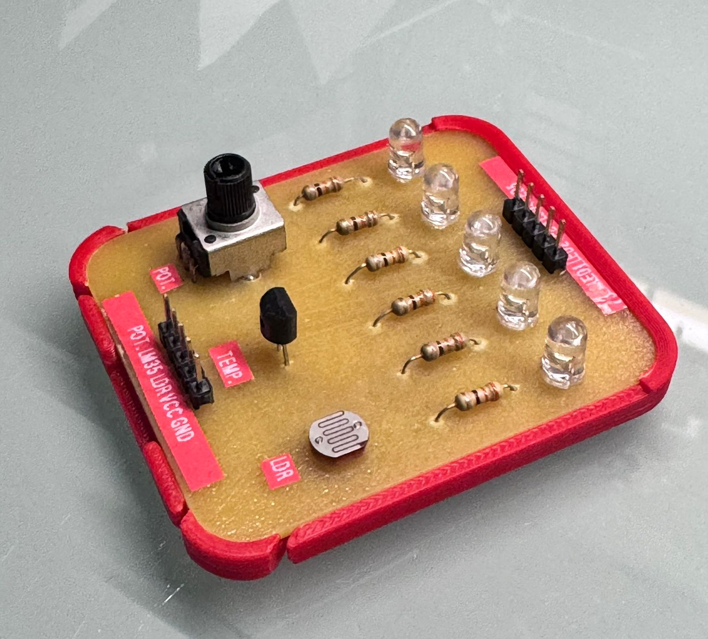
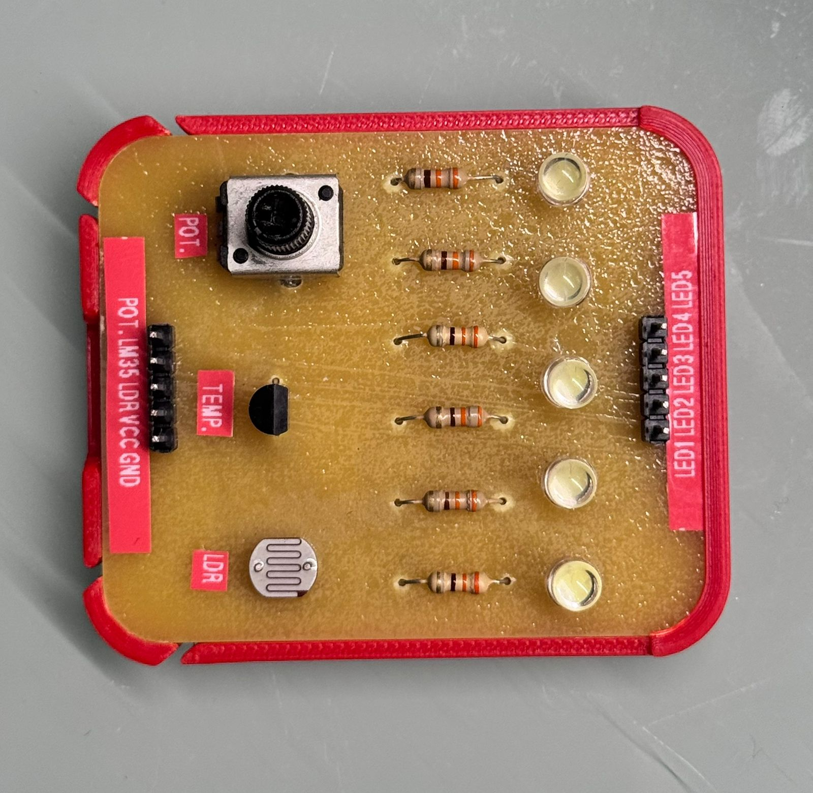

# Multi-Sensor LED Control Board

This is a small open hardware board designed for learning, experimenting, and building.

It controls five LEDs and includes:
- A radial potentiometer
- An LM35 temperature sensor
- An LDR (light-dependent resistor)

Inputs are placed on the left, outputs on the right, making the board intuitive and easy to understand—especially for educational use.

Use it for:
- Learning basic electronics
- Teaching sensors and outputs
- Prototyping ideas
- Playing, breaking, and rebuilding things

---

## What’s in this folder

You may find:
- Schematics
- Reference images or notes

### Images

Multi-Sensor LED Control Board

  

Multi-Sensor LED Control Board Overview

  

---

## Acknowledgements

This project was developed within the context of the Fab Lab at Universidad de Lima — a digital fabrication laboratory where functional prototypes are designed and built as part of open learning and innovation.

You can explore the Fab Lab’s activities and community here:
- Fab Lab Universidad de Lima (Fab Academy Lab)
https://www.fablabs.io/labs/ulima

---

## About

This board was created by Marcela Gonzales Arias as part of an open learning practice.

You can also find more about the designer here:
- Fab Academy page:
  https://fabacademy.org/2024/labs/ulima/students/marcela-gonzales/

(These links are for reference only — no attribution necessary.)

---

## License

Public domain ([CC0 1.0 Universal](/LICENSE))

This project is released into the public domain.

You can use it, change it, share it, build it, or sell it.  
No permission needed.  
No attribution required.

Use it freely.

---

## Notes

This project comes with no guarantees.  
If something breaks, fix it, improve it, or turn it into something new 🙂